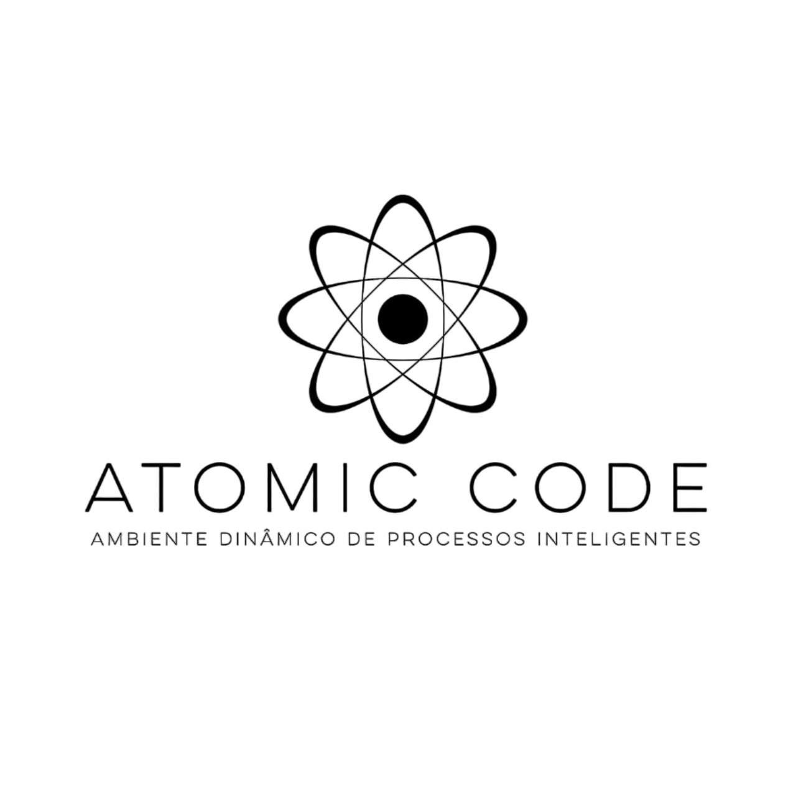

# Estudo de Caso de UX/UI - Projeto SIMPAC

## O Que (WHAT)
### Introdução
Saiba como uma solução construída com base em Design de Interação (UI) e experiência do Usuário (UX) busca melhorar a experiência de uma organizadora que enfrenta o trabalho manual de separar e redirecionar cada processo avaliativo e, posteriormente, calcular as notas finais. Isso se aplica ao contexto do SIMPAC, um simpósio de produção acadêmica premiado ao final, onde a entrega rápida dos resultados é crucial.

## Quando (WHEN)
### Cronograma do Projeto
- Início do Projeto: [Inserir Data]
- Término do Projeto: [Inserir Data]

### Fases do Projeto
1. **Pesquisa e Descoberta:**
    - [25/09/2023 à 29/09/2023]

2. **Design e Iteração:**
    - [11/10/2023 à 31/10/2023]

3. **Testes e Validação:**
    - [01/11/2023 à 15/11/2023]

## Quem (WHO)
### Envolvidos no Projeto
- **Equipe de Design e Desenvolvimento:**
  - [Inserir Nomes e Funções]
- **Clientes e Stakeholders:**
  - NUPEX - Núcleo de Ensino, Pesquisa e Extensão
  - Eliene Coordenadora SIMPAC

### Usuários-Alvo
- Gestores/Organizadores do SIMPAC
- Avaliadores e Grupos Avaliados
- Público Afetado pelos Resultados

## Onde (Where)
### Ambiente de Utilização
- **Online:**
  - A aplicação é acessada por meio de navegadores web, garantindo acessibilidade a partir de qualquer localização com acesso à internet.

## Por Que (Why)
### Desafio
O SIMPAC, um simpósio acadêmico, enfrenta desafios na entrega eficiente de resultados e na gestão manual das avaliações. O projeto visa otimizar esse processo por meio de uma aplicação que proporciona eficiência na organização de projetos por curso, resultando em entregas mais rápidas e menos trabalho repetitivo para os organizadores.

### Objetivos do Projeto
- Automatizar a Organização de Projetos
- Melhorar a Entrega de Resultados
- Otimizar o Tempo

---

### Pesquisa e Descoberta
#### Metodologia
- Reunião de Entendimento do SIMPAC
- Análise de Concorrência
- Pesquisa para Identificar Repetições e Pontos a Melhorar
- Testes de Usabilidade em Duas Faixas Etárias Distintas

#### Resultados da Pesquisa
- Identificação de 3 Nichos de Usuários
- Dificuldades Relatadas pelos Usuários Atuais
- Necessidade de Acesso Rápido aos Resultados

### Design e Iteração
#### Soluções Propostas
- Padronização do Método Avaliativo
- Sistema com Níveis de Acesso
- Criação de Login e Senha para Avaliadores
- Facilidade na Criação e Deleção de Avaliadores
- Comunicação Segura por E-mail e Celular
- Reformulação Geral do Design
- Criação e Edição de Trabalhos Simplificadas

#### Protótipos

- Versão de baixo nível no papel

# Fluxograma
- Foi organizado um fluxograma para orgarnizar as informações, identificar ações que podem ser feitas para os objetivos da organização ou avaliador.

# Wireframe
A partir do fluxograma, foi criado então o wireframe, que é uma representação visual básica e esquemática da estrutura de nossa aplicação web. Seu objetivo principal pe definir a distribuição de elementos da natela, sem se preocupar muito com detalhes visuais.

- Pela tela inicial será possível observar informações como em qual edição o evento se encontra. E qual caminho o usuario gostaria de seguir.
- Para todas escolhas elas serão necessárias um login para confirmar a identidade porém alguns podem ser organizadores e terão um maior nível de acesso.
- O administrador poderá criar os trabalhos para serem avaliados, alterar eles caso tenham cometido erros ou até mesmo apagar, conferir os resultados, checar os avaliadores cadastrados além de poder adicionar ou excluir caso seja necessário.
-  O Avaliador quando terminar suas avaliações lhe será mostrado uma tabela com informações de seus votos e caso o mesmo queira trocar ele terá a oportunidade.
- Para os resultados, que serão disponíveis apenas à organização do evento, lhe será disposto um login e ao entrar, basta escolher o curso que deseja olhar no momento, e será mostrado uma tabela com as notas tanto em poster quanto apresentações orais.

- Protótipo de Alta Fidelidade

[Protótipo](https://www.figma.com/proto/yDMbtaIZQP5urNRLNSLaIW/SIMPAC-por-Vinicius?type=design&node-id=1-4&t=I9H7ZyO9Fwrh1jV3-1&scaling=scale-down&page-id=32%3A289&starting-point-node-id=1%3A4&show-proto-sidebar=1&mode=design)

### Testes e Validação
#### Resultados dos Testes e Validação
- Aumento de 30% na Retenção de Usuários
- Elogios à Usabilidade Aprimorada
- Aprovação do Novo Design

### Próximos Passos e Desenvolvimentos Futuros
- Implementação e Lançamento: [Inserir Datas]
- Avaliação Contínua e Feedback Pós-Lançamento
- Desenvolvimentos Futuros com Base no Feedback

### Conclusão Final
- Avaliação do Impacto Geral no Usuário
- Benefícios Alcançados com o Novo Design

### Agradecimentos e Reconhecimentos
- Membros da Equipe Envolvidos e Seus Papéis
